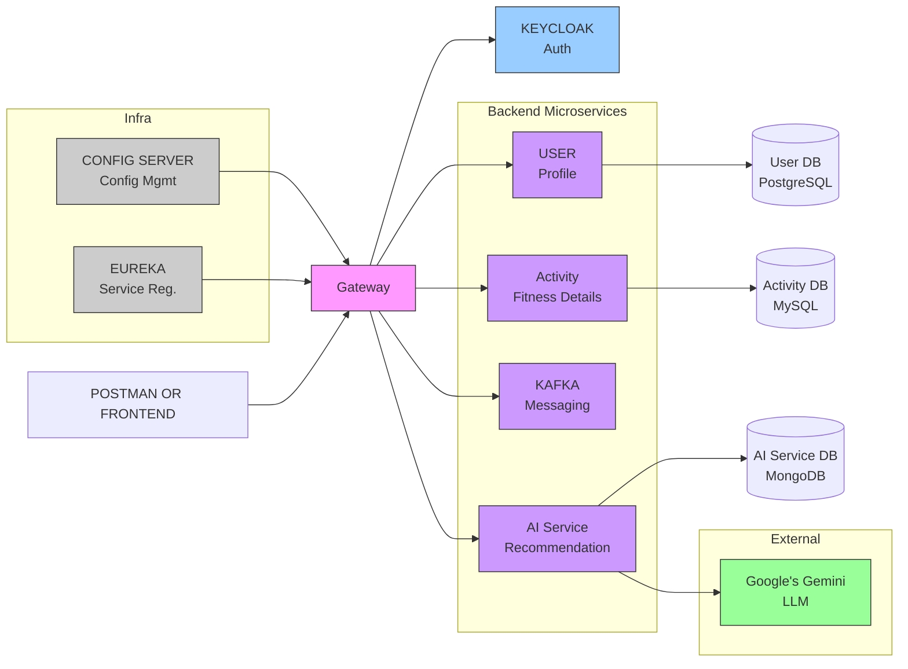

# AI-Powered Fitness Application

[Live Frontend Link]()

[Live Backend Swagger Link]()

  
  &nbsp;&nbsp;
  
  &nbsp;&nbsp;
  
  &nbsp;&nbsp;
  
  &nbsp;&nbsp;
  
  &nbsp;&nbsp;
  
  &nbsp;&nbsp;
  
  &nbsp;&nbsp;
  
  &nbsp;&nbsp;
  
  &nbsp;&nbsp;
  
  &nbsp;&nbsp;
  

## System

**Tech Stack**

- Spring Boot + React Frontend
- Eureka Server (Spring Cloud Netflix)
- Spring Cloud Gateway
- Keycloak - Authentication and Authorization
- Apache Kafka - Async inter-service communication
- PostgreSQL + MySQL + MongoDB
- Google Gemini API - AI model
- Spring Cloud Config Server

**Key Highlights**

- Fully Featured Fitness app on microservice architecture.
- AI Integration on microservices

### Application Architecture

# Microservices

## 👤 User Service

- Remote Swagger URL: 
- Local Swagger URL : [http://localhost:8080/docs.html](http://localhost:8080/docs.html)
- 📘 API Details

| API                            | Method | Purpose          |
| ------------------------------ | ------ | ---------------- |
| `/api/users/register`          | POST   | Create user      |
| `/api/users/{userId}`          | GET    | Get user profile |
| `/api/users/{userId}/validate` | GET    | Validate user    |

| #    | API              | Method | Endpoint                     | Description            | Request                                                      | Response                                                     |
| ---- | ---------------- | ------ | ---------------------------- | ---------------------- | ------------------------------------------------------------ | ------------------------------------------------------------ |
| 1    | Register User    | POST   | /api/users/register          | Create a new user      | Body (RegisterRequest):`email*`, `password* (min 6)`, `keycloakId`, `firstName`, `lastName` | UserResponse: `{"id":"string","keycloakId":"string","email":"string","password":"string","firstName":"string","lastName":"string","createdAt":"date-time","updatedAt":"date-time"}` |
| 2    | Get User Profile | GET    | /api/users/{userId}          | Get user details       | Path:`userId* (string)`                                      | UserResponse : `{"id":"string","keycloakId":"string","email":"string","password":"string","firstName":"string","lastName":"string","createdAt":"date-time","updatedAt":"date-time"}` |
| 3    | Validate User    | GET    | /api/users/{userId}/validate | Check if user is valid | Path:`userId* (string)`                                      | `true`                                                       |

## 🏃 Activity Service

- Remote Swagger URL: 
- Local Swagger URL : [http://localhost:8080/docs.html](http://localhost:8080/docs.html)
- 📘 API Details

## 🔷 AI Service

- Remote Swagger URL: 
- Local Swagger URL : [http://localhost:8080/docs.html](http://localhost:8080/docs.html)
- 📘 API Details

